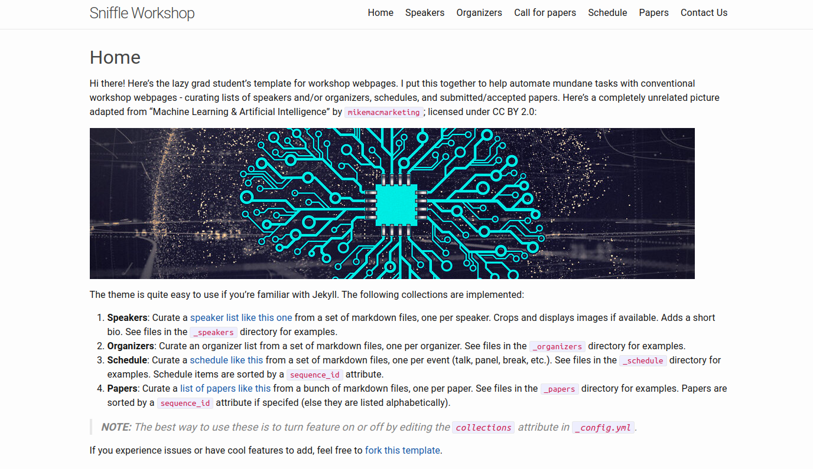
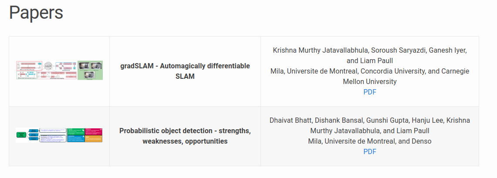
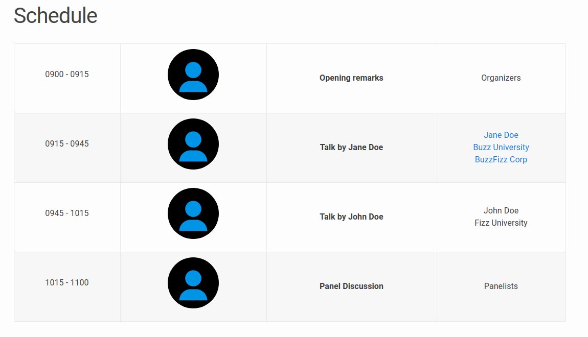
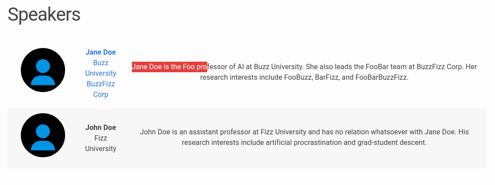

# sniffle-workshop

`sniffle` is an easy-to-use [Jekyll](https://jekyllrb.com/) theme, developed primarily for hosting workshop webpages in the AI / ML communities. `sniffle` automates many of the mundane tasks needed for workshop webpages, including:

* curating **speaker** lists
* curating **organizer** lists
* populating **schedule** webpages
* managing a list of **accepted papers**

`sniffle` came about because of a [lazy grad student](https://krrish94.github.io)'s need to avoid the agonizing pain that went into populating the [DiffCVGP](https://montrealrobotics.ca/diffcvgp) and [Rethinking ML Papers](https://rethinkingmlpapers.github.io) workshop webpages. `sniffle` is based on Jekyll's default (and first) `minima` theme.


**Here's a [preview webpage](https://krrish94.github.io/sniffle-workshop) for the theme.**

Here's sample screenshots of various pages!

   

## Installing Jekyll

For more about how to use Jekyll, check out [these installation instructions](https://jekyllrb.com/docs/installation/).
Why Jekyll? Read this [blog post](https://karpathy.github.io/2014/07/01/switching-to-jekyll/)!


## Installation

Assuming you have [Ruby](https://www.ruby-lang.org/en/downloads/) and [Bundler](https://bundler.io/) installed on your system (*hint: for ease of managing ruby gems, consider using [rbenv](https://github.com/rbenv/rbenv)*), first [fork](https://guides.github.com/activities/forking/) the theme from `github.com:krrish94/sniffle-workshop` to `github.com:<your-username>/<your-repo-name>` and do the following:

```bash
$ git clone git@github.com:<your-username>/<your-repo-name>.git
$ cd <your-repo-name>
$ bundle install
$ bundle exec jekyll serve
```

Now, feel free to customize the theme to your liking!


## Using the theme

The theme is quite easy to use if you're familiar with Jekyll. The following collections are implemented:
1. **Speakers**: Curate a [speaker list like this one](speakers) from a set of markdown files, one per speaker. Crops and displays images if available. Adds a short bio. See files in the `_speakers` directory for examples.
2. **Organizers**: Curate an organizer list from a set of markdown files, one per organizer. See files in the `_organizers` directory for examples.
3. **Schedule**: Curate a [schedule like this](schedule) from a set of markdown files, one per event (talk, panel, break, etc.). See files in the `_schedule` directory for examples. Schedule items are sorted by a `sequence_id` attribute.
4. **Papers**: Curate a [list of papers like this](papers) from a bunch of markdown files, one per paper. See files in the `_papers` directory for examples. Papers are sorted by a `sequence_id` attribute if specifed (else they are listed alphabetically).

> **NOTE:** The best way to use these is to turn feature on or off by editing the `collections` attribute in `_config.yml`.

If you experience issues or have cool features to add, feel free to [fork this template]().


### Adding a speaker

To add a speaker, simply create a copy of `_speakers/janedoe.md`, rename it, and edit the attributes of the speaker. Please read the comments in the markdown file; they describe the function of each attribute.


### Adding an organizer

To add an organizer, simply create a copy of `_organizers/organizerjanedoe.md`, rename it, and edit the attributes of the organizer. Please read the comments in the markdown file; they describe the function of each attribute.


### Adding an event to your schedule

To add an event to the workshop schedule, simply create a copy of `_schedule/talk_00_opening.md`, rename it, and edit the attributes of the event. Please read the comments in the markdown file; they describe the function of each attribute.


### Adding a paper to the workshop's proceedings

To add a paper to the workshop's proceedings, simply create a copy of `_schedule/paper_00.md`, rename it and edit the attributes of the paper. Please read the comments in the markdown file; they describe the function of each attribute.
